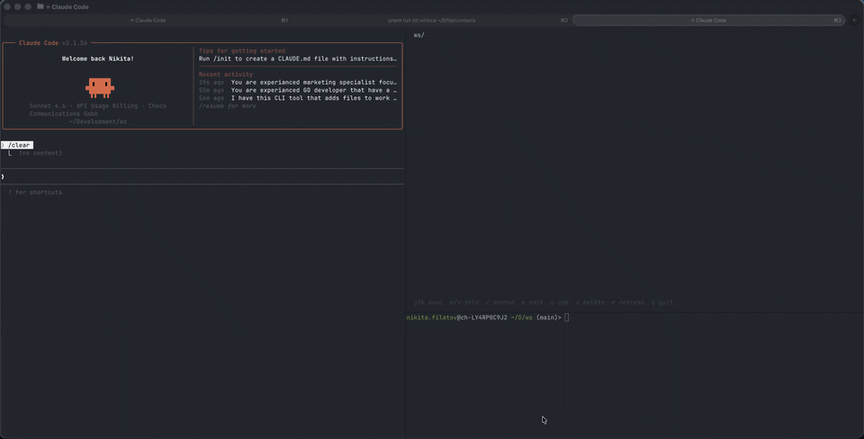

<p align="center">
  <h1 align="center">ws</h1>
  <p align="center">A terminal UI for managing your working set of files</p>
</p>

<p align="center">
  
  
  
</p>

---

You don't need your whole file tree. You need **the files you're working on right now**.

When building a feature, you jump between the same 6 files constantly — but your editor shows you hundreds. You ask Claude Code *"which files are relevant to the auth flow?"* and get a list back — but then what? You open them one by one, lose track, and repeat.

`ws` solves this. It keeps a focused, navigable list of just the files that matter for what you're doing right now. Branch-scoped. Persistent. TUI-first.

```
ws add src/auth/login.go src/middleware/jwt.go
ws
```



---

## The Claude Code Workflow

This is what `ws` was built for.

**1. Ask Claude Code to map out a feature**

```
What files are involved in the user authentication flow?
For each file, run: ws add <filepath>
```

**2. Open `ws` in a split terminal**

```bash
ws
```

You now have a focused, navigable list of exactly the files Claude identified — with git status, tree view, and instant fuzzy search.

**3. Navigate during development**

Press `e` to open any file in your editor. Press `r` to refresh after Claude adds more files. Press `/` to fuzzy-search when the list grows.

**4. Switch branches, keep context**

Working sets are per-branch. Check out a different branch and `ws` shows a completely different set of files. Come back — your context is waiting.

---

## Features

### Branch-scoped working sets

Every git branch has its own working set. Context switches when you do. No manual cleanup, no cross-branch noise.

### Git status at a glance

Files show their current git status inline — `M` for modified, `A` for staged, `?` for untracked. You always know what's changed.

```
src/
  auth/
    login.go         M
    jwt.go           A
  middleware/
    cors.go          ?
```

### Directory tree view

Files are rendered as a collapsible directory tree. Single-child directories collapse automatically (`src/auth/login.go` instead of three levels). Navigate with `←` / `→` to expand or collapse.

### Fuzzy search

Press `/` and type to instantly filter your working set. Matches are highlighted. Press `Esc` to return to the full list.

### Auto-syncs modified files

On startup and refresh, `ws` automatically pulls in any files git knows are modified. Your working set reflects reality.

### Stale set cleanup

`ws` tracks when each branch's working set was last used. When you open it after a while, it offers to clean up sets from branches you've already shipped.

---

## Installation

### Homebrew (macOS / Linux)

```bash
brew tap n-filatov/tap
brew install ws
```

### APT (Debian / Ubuntu)

```bash
curl -fsSL https://n-filatov.github.io/ws/gpg.key \
  | sudo gpg --dearmor -o /usr/share/keyrings/ws.gpg

echo "deb [signed-by=/usr/share/keyrings/ws.gpg] https://n-filatov.github.io/ws ./" \
  | sudo tee /etc/apt/sources.list.d/ws.list

sudo apt update && sudo apt install ws
```

### From source

```bash
git clone https://github.com/n-filatov/ws
cd ws
make install
```

This builds the binary and installs it to `~/.local/bin/ws`. Make sure `~/.local/bin` is in your `PATH`.

**Requirements:** Go 1.21+

---

## Usage

```bash
ws                    # open the TUI
ws add <file>...      # add files to the current branch's working set
ws rm <file>          # remove a file
ws list               # print all files (one per line, good for scripts)
ws clear              # clear the entire working set for this branch
```

### Keybindings

| Key | Action |
|-----|--------|
| `j` / `↓` | Move down |
| `k` / `↑` | Move up |
| `→` | Expand directory |
| `←` | Collapse directory |
| `e` | Open file in editor |
| `/` | Fuzzy search |
| `Esc` | Clear search / quit |
| `a` | Add a file by path |
| `d` | Remove selected file |
| `r` | Refresh (re-sync git status) |
| `q` | Quit |

---

## Configuration

`ws` reads `~/.wsconfig` (plain `key=value` format):

```
editor=nvim
cleanup_days=14
```

| Option | Default | Description |
|--------|---------|-------------|
| `editor` | `vim` | Editor to open files with (`e` key) |
| `cleanup_days` | `7` | Days before a stale working set is flagged for cleanup. Set to `0` to disable. |

---

## How it stores data

Working sets live in `~/.local/share/ws/<repo>/` — outside your repo, never committed.

Each branch gets its own file: `.workingset-<branch-name>`. No conflicts, no `.gitignore` entries needed.

---

## Integrations

### Claude Code

The primary use case. Prompt Claude to identify relevant files and pipe them directly into `ws`:

```
Find all files related to the payment processing feature.
For each file you find, run: ws add <filepath>
```

Then open `ws` to navigate them. Press `r` to pick up any files Claude adds while you're working.

### Scripts and pipelines

`ws list` outputs one path per line — compose it with anything:

```bash
# open all files in your working set in vim
vim $(ws list)

# grep across your working set only
ws list | xargs grep "TODO"

# count lines across working set files
ws list | xargs wc -l
```

---

## Alternatives

- [lazygit](https://github.com/jesseduffield/lazygit) — terminal UI for git. Complementary: use lazygit for commits, `ws` for navigation.
- [harpoon](https://github.com/ThePrimeagen/harpoon) — neovim plugin for marking files. `ws` works at the terminal level, across any editor.
- [zoxide](https://github.com/ajeetdsouza/zoxide) — smart directory jumping. Different scope: `ws` is for files within a project.

---

## Contributing

Issues and PRs welcome. The codebase is small — `internal/tui/` is where most of the interesting logic lives.
